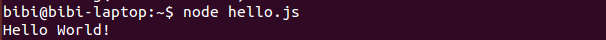

# Linux：源码安装nodejs

[Node.js](http://en.wikipedia.org/wiki/Nodejs)是服务端的JavaScript。这个东西最近很流行。如果你有JavaScript语言基础，并且厌倦了前端开发，你可以学习使用Nodejs开发服务器后端程序。假设你有JavaScript编程基础。


**JavaScript是怎么在服务端运行的呢？**

Node.js运行在Chrome v8环境上，v8是JavaScript引擎，可以运行JavaScript代码。

**安装Node.js**

Node的开发环境：建议使用Linux。我使用的系统为Ubuntu，下面我从源码安装Node。

安装基本开发环境：

```shell
$ sudo apt-get install build-essential
```

使用git clone nodejs源码：

```shell
$ cd
$ git clone https://github.com/nodejs/node
```

checkout最新分支，我安装时，最新版本是v4.4.1：

```shell
$ cd node
$ git checkout v4.4.1
```

创建一个nodejs安装目录：

```shell
$ mkdir ~/my_local
```

编译配置nodejs：

```shell
$ ./configure --prefix=$HOME/my_local/node
```

编译nodejs：

```shell
$ make
```

安装nodejs：

```shell
$ make install
```

配置环境变量：

```shell
echo 'export PATH=$HOME/my_local/node/bin:$PATH' >> ~/.profile
echo 'export NODE_PATH=$HOME/my_local/node:$HOME/my_local/node/lib/node_modules' >> ~/.profile
source ~/.profile
```

**测试nodejs**

使用经典的 **Hello World** 检测Nodejs是否成功安装。创建一个文件 _hello.js_，内容如下：

```javascript
console.log("Hello World!")
```

`console.log` 语句相当于python中的print。执行结果：

