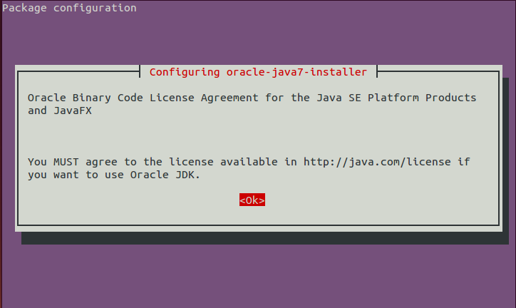
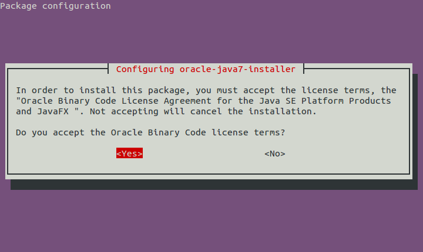
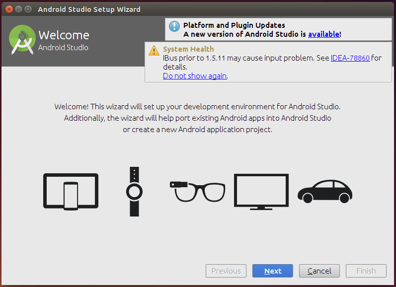
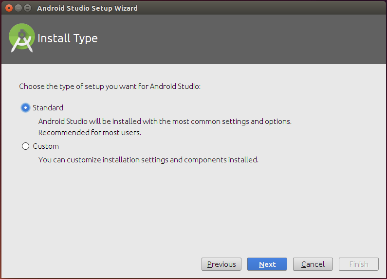
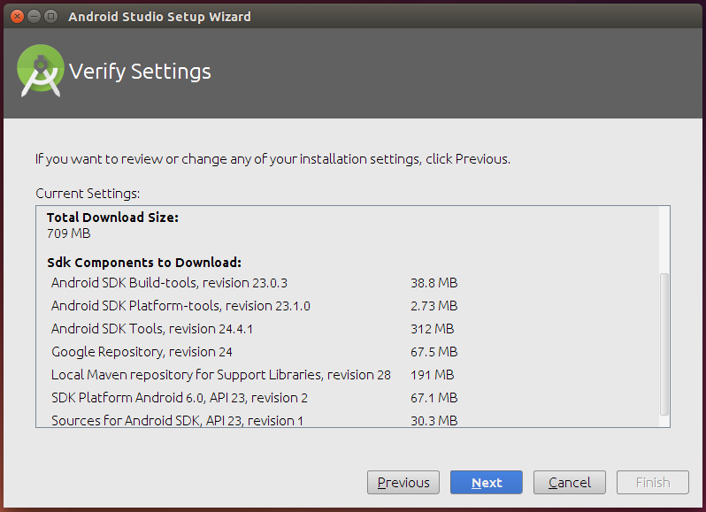
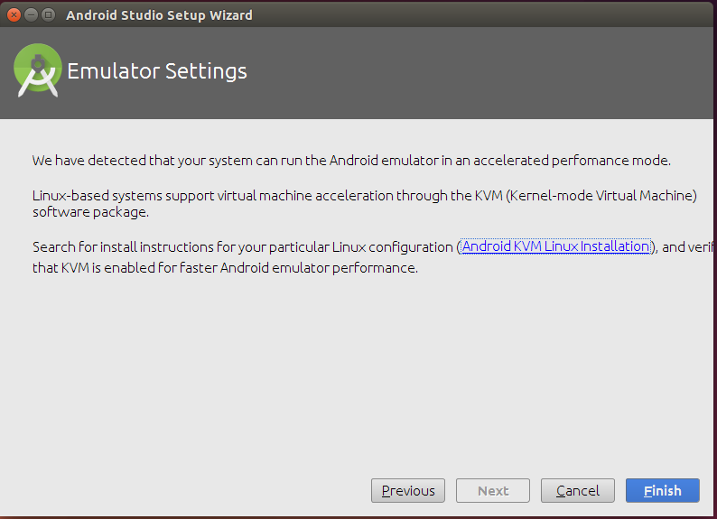
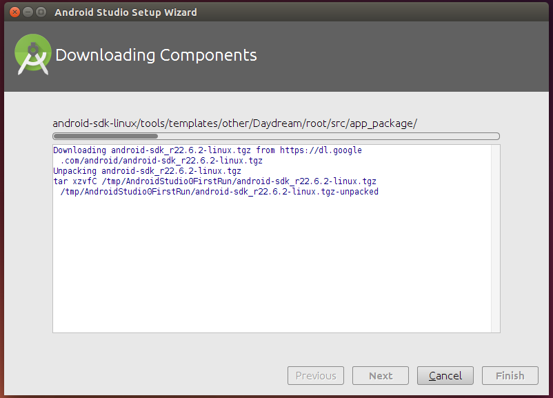
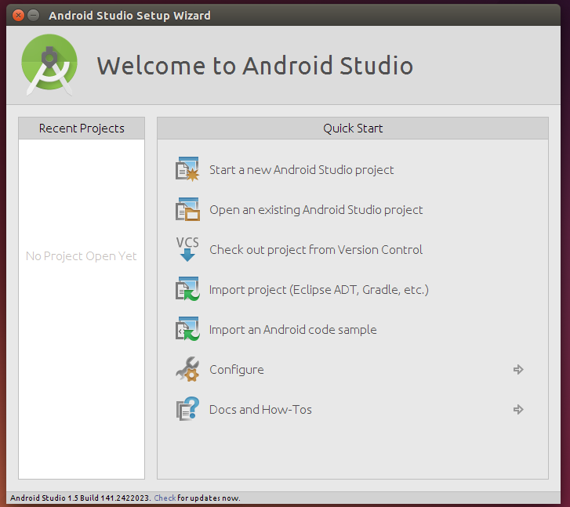

# 在Ubuntu上安装Android Studio

> ⚠️ 本文写于 2016 年，其中涉及的软件版本、下载地址或操作步骤可能已过时，请结合官方最新文档参考。

什么是Android Studio？

**Android Studio** 是google官方的集成开发环境（IDE），它是用来开发Android应用程序的，基于 [IntelliJ IDEA](https://www.jetbrains.com/idea/)

**在Ubuntu上安装Android Studio**

最简单的方法是使用PPA。多谢webupd8team制作的PPA。

Android Studio的需要JDK 7或JDK 8。 让我们先来安装JDK。

执行如下命令，添加PPA：

```shell
$ sudo add-apt-repository ppa:webupd8team/java
```

```shell
$ sudo apt update
```

安装JDK 7：

```shell
$ sudo apt install oracle-java7-installer
```

如果你要使用JDK 8，执行：

```shell
sudo apt install oracle-java8-installer
```

安装过程中需要接受协议，选择OK：



选择Yes：



等待安装完成。

安装完之后，检查JDK是否正确安装。查看Jdk版本：

```shell
$ java -version
```

你应该能看到java版本信息：

```
java version "1.7.0_80"
Java(TM) SE Runtime Environment (build 1.7.0_80-b15)
Java HotSpot(TM) 64-Bit Server VM (build 24.80-b11, mixed mode)
```

下面我们来安装Android Studio，添加PPA：

```shell
$ sudo add-apt-repository ppa:paolorotolo/android-studio
```

```shell
$ sudo apt update
```

安装Android Studio：

```shell
$ sudo apt install android-studio
```

安装完成之后，从菜单启动Android Studio（如果菜单没有，可以重启试试）。在第一次启动时，Android Studio会启动一个设置向导，引导你完成adnroid sdk、android模拟器和其他组件的下载和安装。



Next：



Next：



Next：



Finish：



等待andorid sdk安装完成。

Android studio的样子：



现在，开始开发android app吧。
