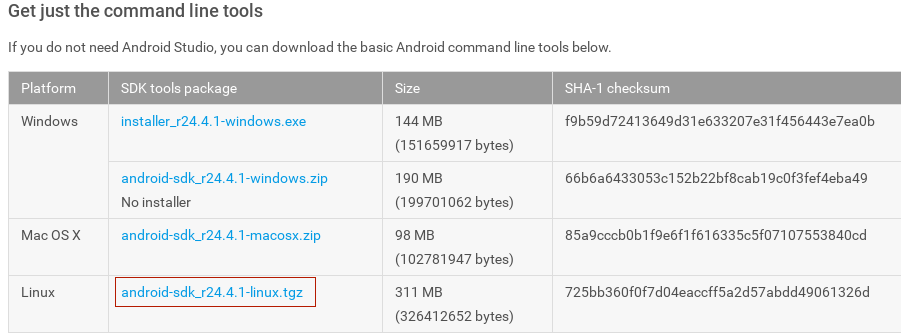
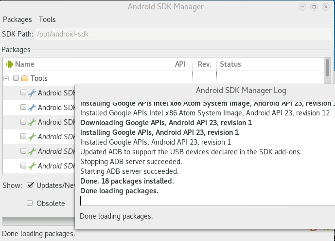
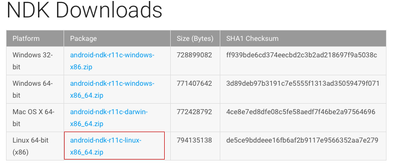

# Android逆向工程基本环境设置

本文的环境搭建方法适用于Linux系统。由于我使用的是Kali Linux，所以下面的安装命令可以用在基于Debian的Linux发行版上。其实在其他操作系统上也大同小异，像Mac OSX和Windows。

### 安装JDK

Kali Linux已经默认安装了Java jdk，dex2jar,dexdump,aapt等工具。

```shell
# apt install openjdk-8-jdk
```

### 安装android SDK

去Android官网下载：<http://developer.android.com/sdk/index.html>。

根据使用的操作系统版本下载对应的sdk：



```shell
# cd ~
# wget http://dl.google.com/android/android-sdk_r24.4.1-linux.tgz
```

解压下载的压缩包：

```shell
# tar zvxf android-sdk_r24.4.1-linux.tgz
```

把sdk放到恰当的目录，我放在`/opt/android-sdk`下。创建目录：

```shell
# mv android-sdk-linux /opt/android-sdk 
```

把tools目录添加到环境变量，在~/.bashrc文件尾加入：

```
export PATH=/opt/android-sdk/tools:$PATH
```

使环境变量生效：

```shell
# source ~/.bashrc
```

打开Android SDK管理器，安装各种开发工具和库：

```shell
# android
```



把platform-tools目录添加到环境变量，在~/.bashrc文件尾加入：

```
export PATH=/opt/android-sdk/platform-tools:$PATH
```

如果有需要，也可以把/opt/android-sdk/build-tools目录加到环境变量中。

使环境变量生效：

```shell
# source ~/.bashrc
```

### 安装android NDK

去官网下载：<http://developer.android.com/ndk/downloads/index.html>

根据使用的操作系统版本下载对应的ndk：



```shell
# cd ~
# wget http://dl.google.com/android/repository/android-ndk-r11c-linux-x86_64.zip
```

解压下载的压缩包：

```shell
# unzip android-ndk-r11c-linux-x86_64.zip
```

移动到/opt/android-ndk：

```shell
# mv android-ndk-r11c /opt/android-ndk
```

把android-ndk目录添加到环境变量，在~/.bashrc文件尾加入：

```
export PATH=/opt/android-ndk:$PATH
```

使环境变量生效：

```shell
# source ~/.bashrc
```

### 下载android源码

创建/opt/bin目录：

```shell
# mkdir /opt/bin
```

把这个目录添加到环境变量：

```
export PATH=/opt/bin:$PATH
```

下载repo工具并添加可执行权限：

```shell
# curl https://storage.googleapis.com/git-repo-downloads/repo > /opt/bin/repo
# chmod a+x /opt/bin/repo
```

初始化repo：

```shell
# repo init -u https://android.googlesource.com/platform/manifest
```

下载源码：

```shell
# cd ~
# mkdir WORKING_DIRECTORY
# cd WORKING_DIRECTORY
```

```shell
# repo sync
```

### 安装Apktool工具

Kali linux自带这个工具，如果没有去[这里](http://ibotpeaches.github.io/Apktool/>)下载安装。

****

[移除Android应用广告－Android逆向工程](2016-4-12-android-reversing-remove-ad.md)

[学习Android逆向工程](2016-4-9-start-learn-android-reversing.md)
