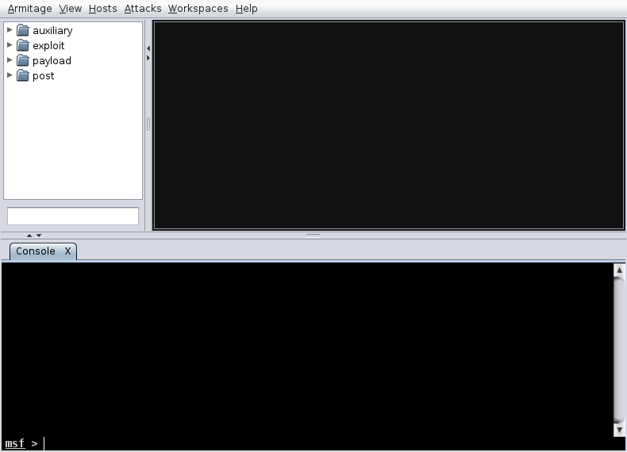
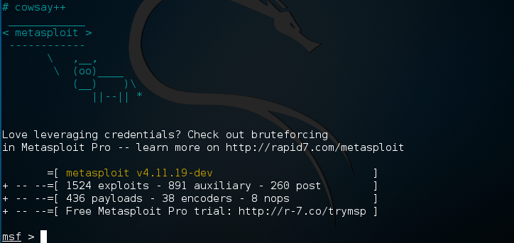

# Metasploit的基本使用

[Metasploit](https://www.metasploit.com)可以在Linux、Windows和Mac OS X系统上运行。我假设你已安装了Metasploit，或者你使用的系统是Kali Linux。它有命令行接口也有GUI接口。

我使用的系统是Kali Linux，本文以这个系统为例。

图形用户界面接口：Armitage



命令行接口：msfconsole

```shell
# msfconsole
```



使用metasploit的基本步骤：

* 运行msfconsole
* 确定远程主机
* 找到一个漏洞并使用这个漏洞
* 配置漏洞选项
* 入侵远程主机

metasploit内建了很多文档，查看方法：

```shell
msf > help

msf > help search
```

*********

获得远程主机信息

你可以在mfs中运行nmap命令：

```shell
msf > nmap -v -sV some_host
```

也可以使用db_nmap，结果输出到metasploit数据库：

```shell
msf > db_nmap -v -sV some_host
```

更多扫描工具：

```shell
msf > search portscan
```

列出db_nmap找到的主机：

```shell
msf > hosts
```

把这些主机加入到目标主机：

```shell
msf > hosts -R
```

也可以使用set RHOST your_target_ip设置目标IP。

这一步的目的是获得要目标主机的系统信息，为下一步选择漏洞和利用漏洞做准备。

其他扫描漏洞的工具：lynix、maltego、wp-scan等等。

* [安装使用lynis扫描Linux的安全漏洞](2016-3-22-How-to-use-lynis-on-linux.md)
* Wordpress：使用WPScan检测易受攻击的插件和主题

********

显示metasploit中所有可以利用的模块：

```shell
msf > show
msf > show auxiliary
msf > show exploits
msf > show payloads
msf > show encoders
msf > show nops
```

搜索可以利用的漏洞：

```shell
msf > search type:exploit
msf > search CVE-xxxx-xxx
msf > search cve:2014
msf > search name:wordpress
msf > search name:mysql
msf > search path:scada
msf > search platform:aix
msf > search type:post
msf > search windows type:exploit
...
```

使用一个漏洞：

```shell
msf > use exploit/path/to/exploit_name
```

设置payload：

```shell
msf > show payloads
msf > set payload path/to/payload
```

入侵：

```shell
msf > exploit
```

如果没有成功，重新选择漏洞。

### 例子：

*****

[演示使用Metasploit入侵Windows](2016-4-15-kali-linux-n-hack-windows-xp.md)

[演示使用Metasploit入侵Android](2016-4-18-kali-linux-metasploit-hack-android.md)
