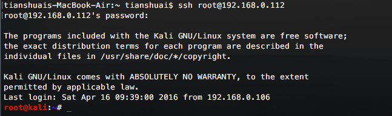
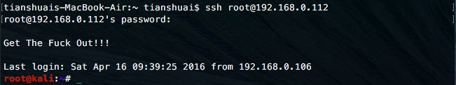

# Kali Linux安装SSH Server

Kali Linux默认并没有安装SSH服务，为了实现远程登录Kali Linux，我们需要安装SSH服务。

### 安装 OpenSSH Server

```shell
# apt-get install openssh-server
```

### 配置SSH服务开机启动

```shell
# update-rc.d -f ssh remove
# update-rc.d -f ssh defaults
# update-rc.d -f ssh enable 2 3 4 5
```

### 更改默认的SSH密钥

由于每个Linux系统都使用相似的密钥，为了提高系统安全，我们更改默认的SSH密钥。

备份原始密钥：

```shell
# cd /etc/ssh
# mkdir ssh_key_backup
# mv ssh_host_* ssh_key_backup
```

创建新密钥：

```shell
# dpkg-reconfigure openssh-server
```

### 允许root用户使用ssh远程登录

默认下，不允许使用root用户进行ssh远程登录，需要改一下ssh的配置文件：

```shell
# vim /etc/ssh/sshd_config
```

把：

```
PermitRootLogin prohibit-password
```

改为：

```
PermitRootLogin yes

```

重启SSH：

```shell
# service ssh restart
```

### 使用其他计算机远程登录



OK，SSH服务设置完成。

从上图可以看到，登录成功之后，会有一些问候信息 balabala。这些文字信息是可以自定义的：

```shell
# vim /etc/motd
```

写入你想要的问候文字。

重启SSH：

```shell
# service ssh restart
```


