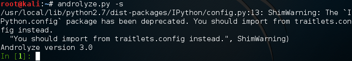
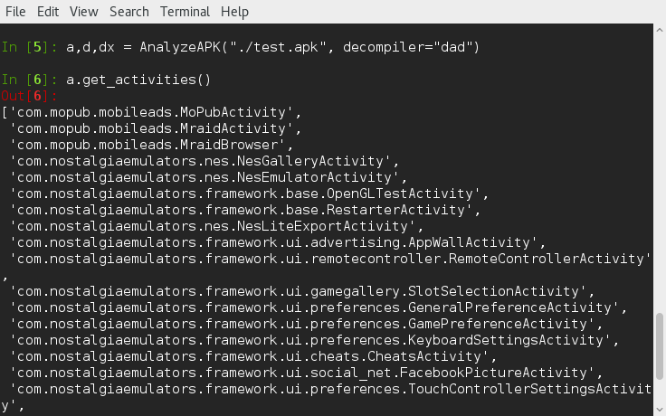
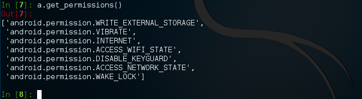

# Android逆向工具：Androguard（一）

本文介绍一下Androguard的安装和使用。

### 什么是Androguard？

Androguard是使用Python编写的逆向工具，它可以在多个平台上运行－Linux/Windows/OSX。使用它可以反编译android应用，也可以用来做android app的静态分析（static analysis）。

### 下载安装Androguard

这里只介绍了在Linux上的安装步骤。我使用的是Kali Linux，其他Linux发行版同样适用。

确保系统中已安装了Python；一般Linux系统都自带Python。

安装IPython和pygments：

```shell
# pip install ipython
# pip install pygments
```

Androguard的源码托管在github，使用git clone下载源码：

```shell
# git clone https://github.com/androguard/androguard.git
```

安装androguard：

```shell
# cd androguard
# python setup.py install
```

我在使用最新源码时，遇到如下错误：

> Python.utils.traitlets.TraitError: The 'config' trait of an InteractiveShellEmbed instance must be a Config or None, but a value of class 'traitlets.config.loader.Config' (i.e. {}) was specified.

使用v2.0版本没有问题：

```shell
# git checkout v2.0    (最新稳定版本是v2.0)
# python setup.py install
```

### 使用Androguard反编译一个应用程序

Androguard支持3个反编译工具：

* DAD
* dex2jar + jad
* DED

下面我使用DAD反编译一个android应用：

1）运行androlyze：

```shell
# androlyze.py -s
```



2）反编译apk文件

```python
a,d,dx = AnalyzeAPK("path/apk", decompiler="dad")
```

3）查看app的所有Activity

```python
a.get_activities()
```



4）查看应用的权限

```python
a.get_permissions()
```



5）其他方法

获得程序中所有类名：

```python
d.get_classes_names()
```

获得程序中定义的字符串：

```python
d.get_strings()
```

获得程序中定义方法：

```python
d.get_methods()
```

****

Androguard文档：http://doc.androguard.re/html/index.html

****

[Android逆向工具：Androguard（二）](2016-4-17-reversing-engineering-android-androguard2.md)

[移除Android应用广告－Android逆向工程](2016-4-12-android-reversing-remove-ad.md)

[Android逆向工程基本环境设置](2016-4-11-android-reversing-env-setup.md)
