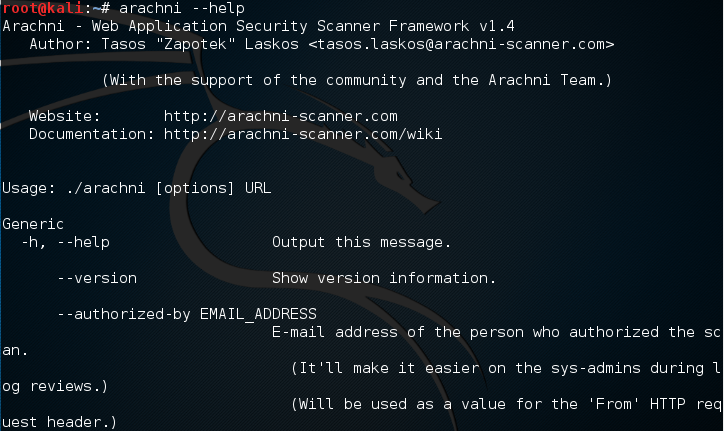
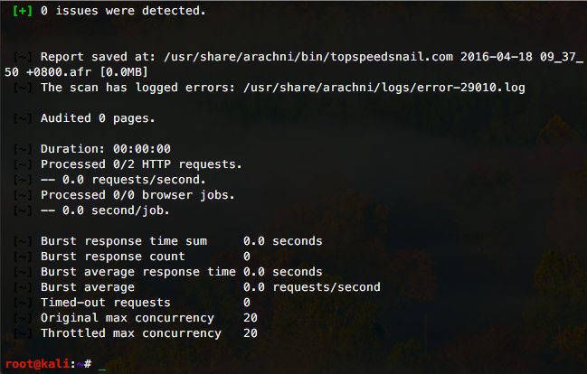

# Kali Linux－arachni - 扫描网站漏洞

arachni是web应用漏洞扫描工具。

如果系统中没有安装arachni；安装arachni：

```shell
# apt install arachni
```

```shell
# arachni --help
```



arachni的项目地址：https://github.com/Arachni/arachni。

更多命令行选项：https://github.com/Arachni/arachni/wiki/Command-line-user-interface

扫描网站漏洞：

```shell
# arachni http://topspeedsnail.com
```



arachni也提供了web接口：https://github.com/Arachni/arachni-ui-web

*****

Wordpress：使用WPScan检测易受攻击的插件和主题

使用WPScan破解wordpress站点密码
