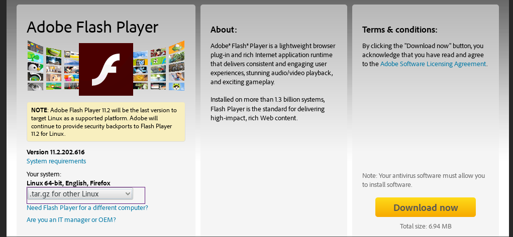

# Kali Linux安装Flash插件

> ⚠️ 本文写于 2016 年，其中涉及的软件版本、下载地址或操作步骤可能已过时，请结合官方最新文档参考。

Kali Linux并没有自带Adobe Flash播放器插件；

在Kali Linux上有两种方法安装Flash；第一种方法比较简单，但是有时不能安装成功；

### 方法1

使用默认仓库安装：

```shell
# apt install flashplugin-nonfree
```

```shell
# update-flashplugin-nonfree --install
```

重启。

### 方法2

去adobe官网下载：https://get.adobe.com/flashplayer/

下载tar包：



解压下载的tar包：

```shell
# tar -xf install_flash_player_11_linux.x86_64.tar.gz
```

把解压出来的libflashplayer.so文件移动到火狐的插件目录：

```shell
# mv libflashplayer.so /usr/lib/mozilla/plugins/
```
