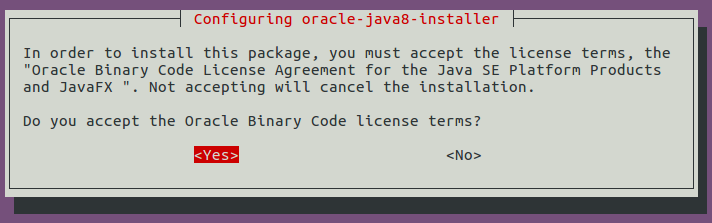
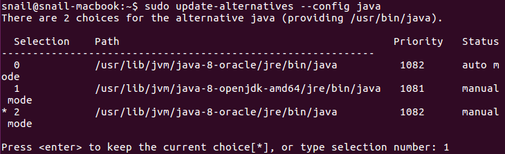

# Ubuntu 16.04安装Java JDK

> ⚠️ 本文写于 2016 年，其中涉及的软件版本、下载地址或操作步骤可能已过时，请结合官方最新文档参考。

Java JDK有两个版本，一个开源版本Openjdk，还有一个oracle官方版本jdk。下面记录在Ubuntu 16.04上安装Java JDK的步骤。

### 安装openjdk

更新软件包列表：

```shell
$ sudo apt update
```

安装openjdk-8-jdk：

```shell
$ sudo apt install openjdk-8-jdk
```

查看java版本：

```shell
$ java -version
```


### 安装oracle Java JDK

首先，安装依赖包：

```shell
$ sudo apt install python-software-properties
```

添加仓库源：

```shell
$ sudo add-apt-repository ppa:webupd8team/java
```

更新软件包列表：

```shell
$ sudo apt update
```

安装java JDK：

```shell
$ sudo apt install oracle-java8-installer
```

安装过程中需要接受协议：



查看java版本：

```shell
$ java -version
```


*****

如果你同时安装了以上两个版本，你可以自由的在这两个版本之间切换。执行：

```shell
$ sudo update-alternatives --config java
```



前面带星号的是当前正在使用的java版本，键入编号选择使用哪个版本。

编辑/etc/profile，在文件尾添加java环境变量：

```shell
$ sudo vim /etc/profile
```

```
# 如果使用oracle java
export JAVA_HOME="/usr/lib/jvm/java-8-oracle"

# 如果使用openjdk
export JAVA_HOME="/usr/lib/jvm/java-8-openjdk-amd64"
```

OK，在Ubuntu 16.04上安装java完成。
