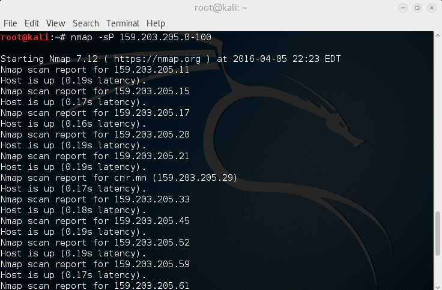
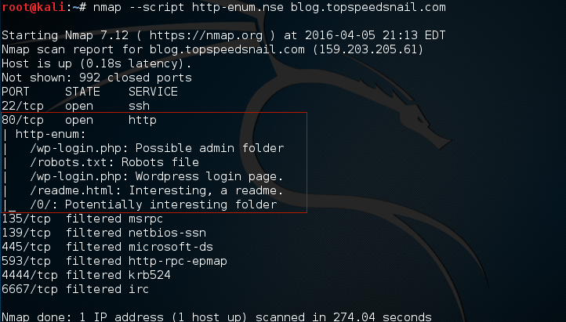

# Kali Linux：使用nmap扫描主机

nmap－Network Mapper，是著名的网络扫描和嗅探工具包。他同样支持Windows和OS X。

## 扫描开放端口和判断操作系统类型

先让我们ping一段地址范围，找到启动的主机：

```shell
# nmap -sP 159.203.205.0-100
```



使用SYN扫描探测操作系统类型：

```shell
# nmap -sS 159.203.205.61 -O
```

扫描开放端口：

```shell
# nmap -sV 159.203.205.61 -A
```

## 扫描web服务器的网站目录

```shell
# nmap --script http-enum.nse blog.topspeedsnail.com
```



上面使用了脚本，存放路径：(/usr/share/nmap/scripts)。目录里有各种各样的脚本。

## 扫描主机SSL Heartbleed 漏洞（2012）

```shell
# nmap -d --script ssl-heartbleed --script-args vulns.showall -sV 192.168.0.106
```
