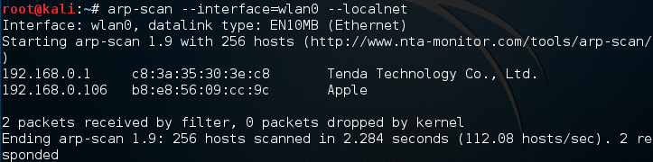
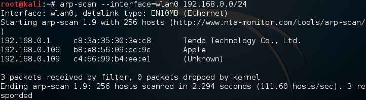

# arp-scan 发现本地网络中的隐藏设备

arp-scan是一个用来进行系统发现的命令行工具。它可以构建并发送ARP请求到指定的IP地址，并且显示返回的任何响应。

> ARP协议被设计成允许被用于任何链路层和网络层协议。然而在实际中它仅用于以太网（包括802.11无线）和IPv4；IPv6使用NDP（邻居发现协议）来代替，这是一种不同的协议。ARP是一个不可路由的协议，因此只能在同一个以太网网络上的系统之间使用。

arp-scan可以显示本地网络中的所有连接的设备，即使这些设备有防火墙。设备可以屏蔽ping，但是并不能屏蔽ARP数据包。

Kali Linux默认安装了arp-scan工具，如果你使用Ubuntu，安装命令：

```shell
$ sudo apt install arp-scan
```

使用：

```shell
# arp-scan --interface=wlan0 --localnet
```

* wlan0是网卡接口，你也许会使用eth0（使用ifconfig命令查看）。
* localnet指定扫描本地网络



从上图你可以看到我的网络是192.168.0/24，再次扫描：

```shell
# arp-scan --interface=wlan0 192.168.0/24
```



arp-scan是很简单的工具，但是很强大；

理解arp是[执行arp欺骗攻击](2016-4-18-kali-linux-preform-man-in-middle-attack.md)的基础。

arp-scan帮助：

```shell
# arp-scan --help
```
