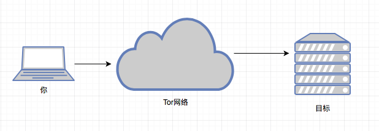
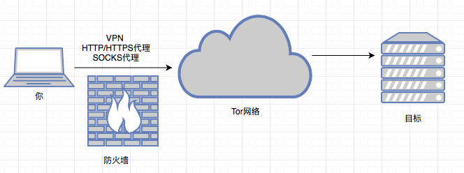

# 使用tor实现匿名扫描/SSH登录

你要做坏事时，最先应该想到匿名。扫描网站／主机，或利用漏洞；甚至在大天朝发帖都有风险，为了防止半夜鬼敲门，我们可以使用tor实现匿名。

如果你不知道tor是什么，看：https://zh.wikipedia.org/wiki/Tor ； https://program-think.blogspot.com/2013/11/tor-faq.html

图示：



在天朝也许要多加一层：



优点：

* 首先有了一个梯子
* 你的ISP提供商并不知道你在使用Tor，它也许知道你在使用代理
* Tor的入口点并不知道你的IP地址，而是代理的ip地址；代理一定要可靠。

安装tor：

```shell
# apt-get install tor proxychains
```

使用代理连接tor网络，下面以lantern为例：

```shell
# tor HTTPProxy 127.0.0.1:8787
```

它可以和大多数的梯子配合使用，但是，最好使用加密的代理（socks／https/vpn）。

使用man tor查看帮助信息.

******

proxychains可以强制TCP的连接使用代理（Tor），它是一个命令行工具。

配置proxychains使用哪个代理：

```shell
# vim /etc/proxychains.conf
```

默认配置的是tor：

```
dynamic_chain
#strict_chain
proxy_dns
#socks4     127.0.0.1 9050
socks5 127.0.0.1 9050
```

使用：

```shell
# proxychains curl -O somewebsite

# proxychains theharvester -d 163.com -b google
```

theharvester是从各种搜索引擎收集信息的工具。

*****

有些应用并不使用代理发送DNS请求，为了防止DNS泄露，使用Privoxy。

```shell
# apt-get install privoxy
```

配置

```shell
# vim /etc/privoxy/config
```

写入一行：

```
forward-socks5   /               127.0.0.1:9050 .
```

****

匿名扫描：

```shell
# proxychains nmap -Pn -sT -p 80,443,21,22,23 google.com
```

匿名SSH登录：

```shell
# torify ssh user@ip_address
```

****

* Kali Linux编译Lantern
* kali linux: 安装Tor浏览器
